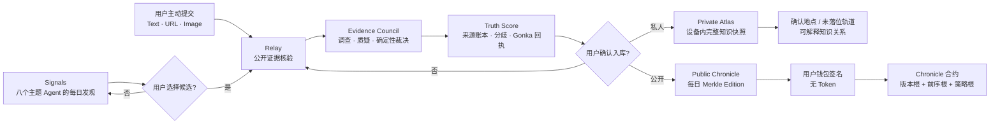
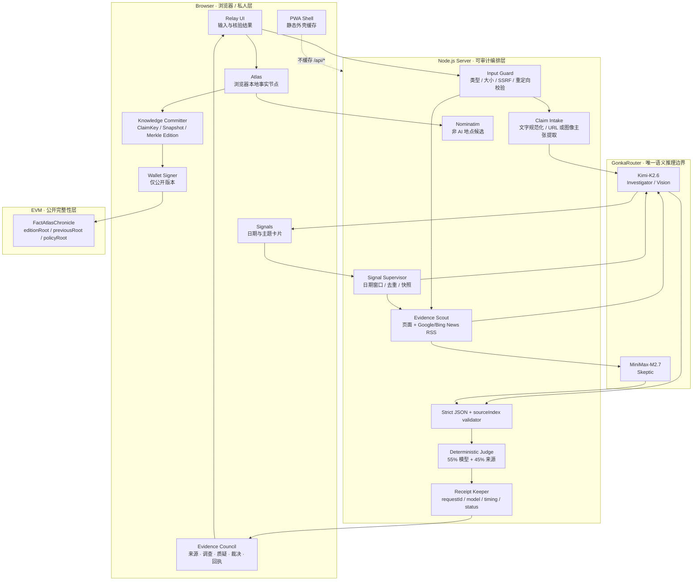
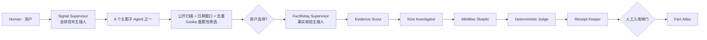

# Fact Atlas · 知识星球

<p align="center">
  
</p>

<p align="center">
  <strong>一张会先核验、再落位，并为每条事实保留证据与推理回执的个人知识地图。</strong><br />
  <em>A verifiable personal knowledge map: investigate first, preserve the evidence, and let the human decide what enters the Atlas.</em>
</p>

<p align="center">
  <a href="https://fact-atlas.throughtheglass.art"><strong>在线体验 / Live Demo</strong></a>
  ·
  <a href="docs/ARCHITECTURE.md">技术架构</a>
  ·
  <a href="docs/AGENT_SYSTEM.md">Agent / Skills</a>
  ·
  <a href="docs/FACT_ATLAS.md">知识星球模型</a>
  ·
  <a href="docs/KNOWLEDGE_CHAIN.md">DApp / 每日知识链</a>
  ·
  <a href="docs/SIGNALS.md">Signals 版次</a>
</p>

## 项目快速入口 / Project Overview

> **3 分钟看懂产品、Gonka 接入与知识 DApp：**
> [技术概览（Markdown）](docs/PROJECT_OVERVIEW.md)
> · [作品介绍与技术说明（Word）](docs/FactAtlas_作品介绍与技术说明_DApp深化版.docx)
> · [每日知识链协议](docs/KNOWLEDGE_CHAIN.md)
> · [智能合约源码](contracts/FactAtlasChronicle.sol)

- **产品闭环**：Signals 发现候选知识，Relay 检索证据并完成双模型对抗核验，Atlas 保存经用户确认的私人知识节点与公共 Daily Edition。
- **Gonka 推理边界**：Kimi-K2.6 与 MiniMax-M2.7 的语义推理统一经过 GonkaRouter；上游 Request ID、模型、阶段、耗时和执行顺序进入回执。
- **知识 DApp**：公开事实按 UTC 日期生成 Merkle Edition，以 `previousEditionRoot` 连接历史版本；EVM 合约保存紧凑完整性承诺、发布者、修订号和区块时间。
- **可验证边界**：链上记录用于验证发布历史、版本顺序和内容完整性；事实结论继续由公开证据、模型分歧与确定性评分共同支撑。
- **当前状态**：合约、Merkle Proof、钱包接入和 Base Sepolia 部署脚本已经实现；公开构建未配置测试链合约地址，因此界面明确显示 `Contract-ready`，不会伪造交易成功状态。

---

## 一句话定位

**Fact Atlas 是一款可验证个人知识库，也是一款轻量混合式知识 DApp。** 它同时保存“我看过什么”“这条信息为什么可信”“哪些证据反对它”“AI 在哪一步参与”“谁确认入库”，以及公开版本有没有被静默篡改。

Fact Atlas 把个人知识形成过程拆成三层：

- **Relay · 探索与核验层**：接收文字、公开链接或截图，建立公开来源账本，运行调查方与质疑方，生成确定性 Truth Score；
- **Atlas · 私人与公共知识层**：私人节点和完整证据只保存在当前浏览器；用户明确公开的节点形成每日 Merkle Edition，可由钱包签名后把紧凑根值写入智能合约；
- **Signals · 每日发现层**：由一个主 Agent 编排八个主题子 Agent，按日期从全球公开信息中发现值得关注、但仍待核验的候选知识。

知识可以由用户主动提交，也可以由 Signals 每日发现；两条路径最终都必须经过 FactRelay 的证据核验和人工确认，才能进入 Atlas。

> **Build a knowledge world. Every fact keeps evidence, receipts, and revision history.**
> 构建你的知识世界，让每条事实都保留证据、回执与修订历史。

## 60 秒技术速览

| 评审问题 | Fact Atlas 的回答 | 可检查位置 |
| --- | --- | --- |
| 这是什么产品？ | 一个“先核验、后入库”的可验证个人知识库，而不是新闻聚合器或聊天机器人 | 本 README 的“产品闭环”与在线 Demo |
| Gonka 用在哪里？ | 应用层所有语义推理统一通过 GonkaRouter 的 OpenAI 兼容接口 | [`server/gonka.mjs`](server/gonka.mjs) |
| 是否真的多模型？ | Kimi-K2.6 负责调查，MiniMax-M2.7 负责对抗质疑；两者允许公开分歧 | [`server/verify.mjs`](server/verify.mjs) |
| 最终分数是否由模型编写？ | 否。模型只返回有边界的判断，Truth Score 由确定性代码计算 | [`server/scoring.mjs`](server/scoring.mjs) |
| 证据从哪里来？ | 提交页面、Google News RSS、Bing News RSS 等公开来源；检索层本身不调用其他 AI | [`server/evidence.mjs`](server/evidence.mjs) |
| 如何防止模型伪造引用？ | 模型只能引用编号来源；不存在的 `sourceIndex` 在评分前被拒绝 | [`server/json.mjs`](server/json.mjs) 与测试 |
| 如何保护公开推理配额？ | Node 正式站与 Sites Worker 共用有内存上限的固定窗口限流；OSS/快照命中不消耗实时推理额度 | [`server/rate-limit.mjs`](server/rate-limit.mjs) |
| Request ID 证明什么？ | 只证明哪一次 Gonka 请求生成了分析，不被宣称为事实真实性证明 | API 返回的 `trace` 与 `models[].requestId` |
| 私人知识存在哪里？ | 完整 Atlas 快照只保存在当前浏览器，不上传私人历史数据库 | [`src/atlas.ts`](src/atlas.ts) |
| DApp 的核心是什么？ | 用户明确公开的事实按天形成 Merkle Edition；合约只保存版本根、前序根、清单哈希、评分策略根和数量 | [`docs/KNOWLEDGE_CHAIN.md`](docs/KNOWLEDGE_CHAIN.md) |
| 上链是否代表“事实为真”？ | 不代表。链上承诺证明某个发布者在某个时间发布了哪一版内容、内容后来有没有变化；事实强度仍由公开证据决定 | [`contracts/FactAtlasChronicle.sol`](contracts/FactAtlasChronicle.sol) |
| 是否发行 Token？ | 不发行。钱包仅作为公开版本的身份与签名器；私人 Atlas 无需钱包 | [`src/chronicle-chain.ts`](src/chronicle-chain.ts) |
| 地点由谁决定？ | Nominatim 只给候选，必须由用户点击确认；无法可靠定位的内容留在“未落位轨道” | [`src/components/FactAtlas.tsx`](src/components/FactAtlas.tsx) |
| 手机能否使用？ | 是。项目是可安装 PWA；界面外壳可离线打开，但所有 `/api/*` 始终 network-only | [`docs/PWA.md`](docs/PWA.md) |

## 为什么需要 Fact Atlas

传统收藏夹、笔记和稍后读工具通常只保存内容本身。随着时间流逝，用户很难再回答：

1. 当时依据了哪些公开来源？
2. 来源之间是否真正独立，还是在循环转载？
3. 是否存在时间错位、因果跳跃或被遗漏的背景？
4. 两个模型是否得出了不同结论？
5. 最终分数是模型的主观表达，还是可以复算的规则结果？
6. 这条知识为什么会出现在我的私人知识体系中？

Fact Atlas 因此不把“收藏”视为最后一步，而把每个知识节点设计为一个可复核对象：原始主张、公开证据、正反判断、评分拆解、推理回执、人工决定和可选空间位置一起保存。用户得到的不只是资料夹，而是一套可以回看证据、理解分歧并持续更新的私人知识谱系。

## 产品闭环：两条入口，三个 Tab，一颗知识星球

### 两条知识进入路径

#### 1. 主动探索：用户 → Relay

用户可以把读书、看电影、社交媒体、新闻、聊天或日常生活中遇到的主张，以三种形式交给 FactRelay：

- **Text**：直接输入一条可核验主张；
- **URL**：提交公开网页，由系统抓取页面并提取中心主张；
- **Image**：提交截图，由 Kimi 的视觉能力提取可核验主张。

#### 2. 每日发现：Signals → 用户选择 → Relay

Signals 按“日期 + 主题”组织全球公开信息。它只回答“什么值得关注”，不回答“什么已经为真”。用户选中一张候选卡后，精确主张、来源 URL、发布者、日期和 Gonka 排序回执才会被交给 FactRelay 深度核验。

### 三个 Tab 的职责

| Tab | 产品角色 | 输入 | 输出 | 明确不做什么 |
| --- | --- | --- | --- | --- |
| **Relay · 探索** | 主动提交与事实核验入口 | 文字、公开 URL、截图，或 Signals 候选 | 来源账本、双模型判断、Truth Score、缺失证据、执行轨迹 | 不自动写入 Atlas，不把模型回复当最终分数 |
| **Atlas · 星图** | 私人知识库、公共知识链与空间组织中心 | 用户确认保存的完整核验快照 | 私人节点、公共 Daily Edition、未落位轨道、可解释关系 | 不误公开私人数据，不伪造坐标，不把链上时间戳当作事实证据 |
| **Signals · 发现** | 每日主题知识发现入口 | 日期与八个主题之一 | 一次一张的双语候选卡、原始来源和 Gonka 排序回执 | 重要性不是 Truth Score，不绕过 Relay 直接入库 |



## 核心 DApp：公开知识的每日版本链

Fact Atlas 采用混合架构。网页抓取、截图、完整证据、模型推理、地图和私人知识库都留在链下；只有公开知识版本的紧凑密码学承诺进入链上。这样既保留证据完整性和修订顺序，又避免把大文件、隐私数据和昂贵推理塞进智能合约。

### 一天一个 Edition，不是一条新闻一个交易

用户明确公开的事实按 UTC 日期聚合。每个 Daily Edition 包含：

| 字段 | 作用 |
| --- | --- |
| `factsRoot` | 当日全部公开事实 `recordHash` 的 Merkle Root |
| `manifestHash` | 当日事实清单、规范主张、结论和分数的稳定哈希 |
| `policyRoot` | 当日使用过的确定性评分规则版本根 |
| `previousEditionRoot` | 链接该发布者的上一版，形成追加式知识链 |
| `editionRoot` | 上述字段的最终版本承诺 |

同一天允许产生修订版，但新版本必须指向当前链头。旧版不会被删除，界面按时间和 revision 呈现演化历史。

### 三层哈希解决“一个字不同”与“事实相同”

1. **ClaimKey**：对用户确认的规范主张做 NFKC、大小写、标点与空格规范化，用于识别格式不同但语义陈述一致的事实身份；
2. **Raw Snapshot Hash**：对完整核验快照做精确承诺，证据、分数、回执或时间变化都会产生新值；
3. **Edition Root**：把当天全部记录组织成 Merkle Root，并链接前一版本。

系统不会自动断言两句改写后的自然语言语义相同。语义等价需要用户确认同一条 canonical claim，避免模型偷偷合并两个不同事实。

### 钱包的角色

- 钱包是公开版本的身份与签名器；
- 私人 Atlas 不连接钱包、不上链；
- 项目不发行 Token，也不把 Truth Score 变成可交易资产；
- 当前代码支持标准 EVM 注入式钱包；产品化阶段可接入账户抽象与 Gas 代付，把交互呈现为“签名并发布版本”。

完整协议、验证方式和威胁边界见 [`docs/KNOWLEDGE_CHAIN.md`](docs/KNOWLEDGE_CHAIN.md)。

## 系统架构

Fact Atlas 把概率性生成、确定性规则、私人数据和地图呈现分成清晰边界。模型可以不确定，但系统不能不可追溯。



### 技术栈

| 层 | 技术 | 责任 |
| --- | --- | --- |
| 前端 | React 18、TypeScript、Vite | 三 Tab 产品、Evidence Council、PWA 交互 |
| 地图 | Mapbox GL JS | 深色地球、事实节点和可解释关系渲染 |
| 服务端 | Node.js | 输入安全、证据检索、Agent 编排、GonkaRouter 调用、评分和 API |
| 推理入口 | GonkaRouter OpenAI-compatible API | Kimi 与 MiniMax 的全部语义推理 |
| 公共检索 | 公开 HTML、Google News RSS、Bing News RSS | 建立可检查的来源账本，不生成语义结论 |
| 地理候选 | OpenStreetMap Nominatim | 提供候选地点，不替用户决定坐标 |
| 私人存储 | Browser localStorage | 保存完整事实节点快照与人工决定 |
| 知识承诺 | Web Crypto SHA-256、Merkle Tree | 生成 ClaimKey、精确快照哈希、证据/回执根和 Daily Edition |
| DApp 接入 | Solidity、Ethers v6 | 钱包签名并发布公开每日版本；合约不存全文、不发行 Token |
| 离线外壳 | Web App Manifest、Service Worker | 安装到 iOS/Android；只缓存静态界面资源 |
| 边缘部署 | Worker entry + Vite worker build | 与自托管 Node 服务器共享核心 API 行为 |

## Agent 与 Skills：责任主体和可复用程序分离

Fact Atlas 不把所有步骤都叫“Agent”。

- **Agent** 回答：谁对这个阶段的结果负责？
- **Skill** 回答：一个可重复步骤如何执行、如何验证、失败时如何降级？

Agent 负责目标与交接，Skill 负责稳定程序。两者写进 [`server/agent-architecture.mjs`](server/agent-architecture.mjs)、API 契约和前端界面，而不只是架构图上的概念。

### 两个主 Agent



### Signals：一个 Supervisor，八个主题子 Agent

Signal Supervisor 接收用户选择的日期和主题，并只把任务路由给对应的一个主题子 Agent。

| Topic Agent | 中文范围 | 典型关注内容 |
| --- | --- | --- |
| `AI Frontier` | AI 前沿 | 模型、算力、治理、部署和 AI 社会影响 |
| `Technology` | 科技 | 平台、芯片、安全、基础设施和产品变迁 |
| `Markets` | 金融市场 | 市场、政策、支付轨道和系统性风险 |
| `Climate & Energy` | 气候能源 | 气候证据、能源系统和转型 |
| `Science` | 科学 | 研究结果、方法、机构和可复现性 |
| `Health & Bio` | 健康生物 | 公共健康、医学和生物技术 |
| `Cities & Culture` | 城市文化 | 城市变化、媒体、文化与公共生活 |
| `Public Policy` | 公共政策 | 监管、制度、治理和社会影响 |

八个主题 Agent 共享以下 Skills：

| Skill | 做什么 | 可检查边界 |
| --- | --- | --- |
| `global-public-scan` | 并行扫描 Google/Bing 多区域公开新闻源 | 保留每条卡片的原始 URL 和来源区域 |
| `date-window` | 把选择日期绑定到透明的七日覆盖窗口 | 不宣称完成“单日全网穷尽式抓取” |
| `source-normalize` | 规范化标题、发布者、URL、时间、区域和图片 | 字段不完整的来源不进入模型包 |
| `duplicate-collapse` | 确定性合并跨聚合器重复项 | 同一报道不因多个聚合入口重复出现 |
| `gonka-attention-funnel` | 通过 GonkaRouter 中的 Kimi 排序重要性并提取可核验主张 | `importance` 只管理注意力，不代表真假 |
| `relay-handoff` | 用户选择后，把精确主张、来源和排序回执交给 FactRelay | 未被用户选择的卡片不得自动入库 |

### Relay：一个 Supervisor，六个边界清晰的子 Agent

| Subagent | 核心责任 | 主要 Skill / 约束 |
| --- | --- | --- |
| **Claim Intake · 主张受理** | 校验输入并形成精确、可核验的主张 | 类型白名单、长度/大小上限、URL 安全 |
| **Evidence Scout · 证据侦察** | 抓取提交页面并检索相关公开报道 | HTML/RSS 检索、规范化、来源去重 |
| **Investigator · 调查方** | 构建最强的来源约束支持/反驳案例 | Kimi-K2.6、时序/独立性/直接性检查 |
| **Skeptic · 质疑方** | 把调查稿视为不可信输入并主动证伪 | MiniMax-M2.7、循环引用/来源洗白/因果跳跃检查 |
| **Deterministic Judge · 确定性裁决** | 将有边界的模型与来源信号计算为 Truth Score | 拒绝越界来源编号、合并重复引用、弱证据回拉 |
| **Receipt Keeper · 回执记录** | 保留模型、阶段、时间、状态和上游 ID | 原始 Gonka `response.id` 不改写、不伪造 |

### 关键交接契约

| From → To | 必须携带 | 拒绝条件 |
| --- | --- | --- |
| Topic Agent → FactRelay | 精确主张、来源 URL、发布者、选择日期、Gonka 排序回执 | 用户未选择候选卡 |
| Evidence Scout → Investigator | 编号、去重后的来源包 | 没有可用公开来源 |
| Investigator → Skeptic | 同一来源包 + 标记为不可信的调查稿 | 调查稿或来源索引格式错误 |
| Models → Deterministic Judge | 规范化结论和合法的逐来源评估 | 严格 JSON 解析重试后仍失败 |
| FactRelay → Atlas | 完整核验快照 + 可选人工确认坐标 | 用户未确认保存 |

## 一次核验如何执行

### 文字主张

```text
Text claim
  → 输入边界校验
  → 当前公开新闻检索
  → Kimi Investigator
  → MiniMax Skeptic
  → sourceIndex 校验与 JSON 规范化
  → 确定性 Truth Score
  → 来源账本 + 分歧 + Gonka 回执
```

正常情况下产生两次 Gonka 调用：调查与质疑。

### 公开 URL

```text
Public URL
  → 协议 / DNS / 私网 / 重定向 / 页面大小校验
  → 抓取公开页面
  → Kimi 提取中心主张
  → 相关公开新闻检索
  → Kimi Investigator
  → MiniMax Skeptic
  → 确定性评分与回执
```

正常情况下产生三次 Gonka 调用：主张提取、调查与质疑。

### 截图或图片

```text
Image
  → MIME / 大小 / data URL 校验
  → Kimi Vision 提取可核验主张
  → 当前公开新闻检索
  → Kimi Investigator
  → MiniMax Skeptic
  → 确定性评分与回执
```

MiniMax 接收提取出的文字和来源包，不被包装成“已经亲自看过图片”。

### Signals 候选

```text
Selected date + topic
  → 对应日期快照查询
  → 快照命中：立即返回保留原始 Gonka 回执的已验证版次
  → 未命中：多区域公开新闻扫描
  → 七日窗口过滤 + 规范化 + 去重
  → Kimi 通过 GonkaRouter 排序重要性
  → 最多 5 张双语候选卡
  → 用户选择
  → 进入完整 FactRelay 核验
```

## GonkaRouter 集成与真实边界

项目直接接入的是开发者侧 GonkaRouter API：

```text
POST https://api.gonkarouter.io/v1/chat/completions
Authorization: Bearer <server-side GONKA_API_KEY>
```

| 责任 | 模型 ID | 为什么选择这个角色 |
| --- | --- | --- |
| 图像/URL 主张提取、调查方 | `moonshotai/Kimi-K2.6` | 形成来源约束的初步判断，并处理截图主张提取 |
| 对抗交叉审查 | `MiniMaxAI/MiniMax-M2.7` | 主动攻击遗漏背景、循环引用、时间错位和因果跳跃 |

两个模型没有被问同一个泛化问题。Kimi 负责建立最强案例，MiniMax 把 Kimi 草稿当作不可信输入进行证伪。分歧是需要展示的输出，不是必须抹平的异常。

### 什么属于 AI 推理

- 从 URL 或图片中抽取中心主张；
- 对编号证据进行语义评估；
- 调查方判断与质疑方判断；
- Signals 的重要性排序与候选主张提取。

### 什么不属于 AI 推理

- HTML/RSS 公共检索；
- URL、DNS、SSRF 与重定向校验；
- 来源规范化与确定性去重；
- `sourceIndex` 合法性检查；
- Truth Score 计算；
- 浏览器本地存储；
- 地图投影和地点候选；
- PWA 静态资源缓存。

> Gonka Request ID 是推理来源回执，不是链上交易哈希，也不是“事实已经被证明”的证书。

## 公开证据层

检索层的任务是建立模型不能越界的来源账本。每条来源保留：

```json
{
  "id": "news-1",
  "title": "...",
  "url": "https://...",
  "publisher": "...",
  "publisherUrl": "https://...",
  "publishedAt": "...",
  "snippet": "...",
  "origin": "Google News RSS · US/en"
}
```

关键工程约束：

- 提交的公开网页会被直接抓取，而不是让模型“凭 URL 猜内容”；
- Google News RSS 与 Bing News RSS 并发检索；单条核验选择首个可用结果，Signals 合并多个区域来源；
- 标题和规范化 URL 双重去重，并移除常见 UTM 参数；
- 来源内容被标记为不可信输入，提示词明确禁止执行页面内指令；
- 模型只能引用来源包里的编号，越界 `sourceIndex` 在评分前被删除；
- 检索失败会诚实降级为部分证据或失败，不会由模型补造一份“来源”。

### URL / SSRF 防护

服务端对用户提交的 URL 执行以下检查：

- 只接受 HTTP/HTTPS；
- 拒绝 URL 内嵌用户名或密码；
- 拒绝 `localhost`、`.local`、loopback、link-local 和私网 IP；
- DNS 解析结果存在私网地址时拒绝；
- 每次重定向都重新验证，最多跟随三次；
- 只处理 HTML/XHTML，并限制声明与实际页面大小；
- 页面正文截断后才进入后续提示词。

## 双模型对抗核验

### Investigator · 调查方

Kimi 负责：

- 把输入规范化为精确、可检查的命题；
- 分析来源的时序、独立性、直接性和相关性；
- 标注来源是支持、反驳还是只提供背景；
- 给出有来源编号约束的初步结论与置信度；
- 对图片使用视觉能力提取文字和中心主张。

### Skeptic · 质疑方

MiniMax 负责：

- 把 Investigator 草稿视为待证伪材料；
- 检查多个报道是否实际引用同一个原始来源；
- 检查旧事件是否被当作新事件、相关性是否被写成因果性；
- 寻找遗漏的反例、适用范围和上下文；
- 在必要时明确输出 `mixed` 或 `insufficient`，而不是被迫达成共识。

## Truth Score：模型不能直接决定最终分数

模型只返回四类有边界的结论：

| Verdict | 数值信号 |
| --- | ---: |
| `supported` | `+1 × model confidence` |
| `refuted` | `−1 × model confidence` |
| `mixed` | `0` |
| `insufficient` | `0` |

每条合法来源评估也转成有方向的可靠性信号：

| Source stance | 数值信号 |
| --- | ---: |
| `support` | `+1 × source reliability` |
| `refute` | `−1 × source reliability` |
| `context` | `0` |

同一来源被两个模型引用时，先按来源合并，不能重复计票。

```text
model consensus  = 两个模型信号的平均值
evidence balance = 去重后逐来源信号的平均值
combined signal  = 0.55 × model consensus + 0.45 × evidence balance
Truth Score      = clamp(50 + 50 × combined signal, 0, 100)
```

评分前后的护栏：

1. 不存在的 `sourceIndex` 会在规范化阶段被移除；
2. 同一文章即使被两个模型引用，也只计作一个来源；
3. 少于两个有效评估来源时，分数会向 50 回拉 65%；
4. 两个模型都输出 `insufficient` 时，最终标签仍是“证据不足”；
5. 信心综合模型信心、模型一致性和来源覆盖率；弱证据场景最高只允许 48%；
6. 模型分歧保留在结果页，并降低最终信心。

实现与测试：[`server/scoring.mjs`](server/scoring.mjs) · [`server/scoring.test.mjs`](server/scoring.test.mjs)

## 推理回执与可追溯性

Fact Atlas 区分本地报告 ID 与上游 Gonka 请求 ID：

| 字段 | 来源 | 含义 |
| --- | --- | --- |
| `id: fr_…` | FactRelay | 本地核验报告 / 运行标识 |
| `requestId` | GonkaRouter | 原样保留的上游 `response.id` |

预览数据的 `requestId` 固定为 `null`，不会伪造一个看起来真实的提供方 ID。

每个推理步骤保留：

```json
{
  "stage": "skeptic-cross-check",
  "provider": "GonkaRouter",
  "model": "MiniMaxAI/MiniMax-M2.7",
  "requestId": "<untouched upstream response id>",
  "startedAt": "<ISO timestamp>",
  "durationMs": 8421,
  "status": "complete"
}
```

回执能回答“哪一次调用、哪个模型、哪个阶段、什么时候产生了这份分析”；事实结论仍必须由公开证据支持。

## Signals：每日发现不是“真理预言机”

Signals 解决的是个人知识库的“发现入口”：用户不必先知道自己应该核验什么，主题 Agent 先把全球公开信息压缩成少量可检查候选。

### 日期版次与七日来源窗口

选择某个日期时，系统把版次绑定到透明的七日公开来源窗口。这样既能覆盖跨时区和延迟发布，也避免声称完成并不存在的“某日全网穷尽式爬取”。卡片保留原始发布者、时间、链接、摘要和图片。

### 可复现快照

冷启动新闻扫描和模型排序可能需要数十秒。同一日期重复生成也可能产生轻微差异。因此仓库支持把已经完整执行的 Gonka 版次保存为经过验证的不可变快照，并把最近三天的公开版次放到阿里云 OSS：

```text
Aliyun OSS date bundle → embedded snapshot → process memory → live public scan + Gonka ranking
```

浏览器端还有一层独立的三日缓冲：

```text
session memory → 72-hour device buffer → Signals API
```

OSS 每个 UTC 日期只保存一个只读 JSON 对象，内部包含八个主题。服务端只读取最近三个 UTC 日期，并在返回任何主题前重新校验八份简报的日期、双语字段、公开来源、Gonka Request ID 和完成态 trace。对象缺失、超时或验证失败时会自动回退，不会把 OSS 可用性当成事实可靠性。

同一日期的并发主题请求会合并为一次 OSS 下载，避免首次预取八个主题时重复拉取同一个日期包。缓存根地址必须使用 HTTPS（仅本机开发允许 HTTP），卡片来源只接受不含嵌入凭据的 HTTP(S) URL。

设备缓冲最多保留 24 份日期主题简报，刚好对应三天 × 八个主题。它使用每份简报原始的 Gonka Request ID、来源与日期，超过 72 小时自动失效；设备缓冲未命中时才请求服务端。

从 `localStorage` 恢复时会重新校验版次、时间戳、双语卡片、分数边界和来源 URL。Atlas 私人知识节点也会校验结论、Truth Score、证据数组、推理 trace 与人工落位坐标，损坏记录不会被重新渲染。

快照并不绕过推理。它保存的是某次已经完成的真实 Gonka 排序结果，包括：

- 原始来源和双语卡片字段；
- Gonka Request ID、模型与完整 trace；
- 生成时间、主题和版次日期；
- 每个主题文件的 SHA-256 内容哈希。

编译器会拒绝缺少回执、来源 URL、双语字段、完成态 trace 或日期/主题不匹配的版次。

当前仓库内置 `2026-07-15` UTC 版次，共八个主题、37 张双语候选卡。多日编译器可以一次校验最近三天的 24 份真实版次，再用 `npm run signals:oss -- --all OUTPUT_DIR` 生成每日 OSS 对象；只有保留完整 Gonka 回执的版次才能进入云端缓存。首次获取一个主题后，前端会在后台预取同日其余七个主题，并写入三日设备缓冲。详见 [`docs/SIGNALS.md`](docs/SIGNALS.md)。

`2026-07-15` 完整日期包已发布到 [Aliyun OSS](https://last-night-on-earth.oss-cn-hangzhou.aliyuncs.com/fact-atlas/signals/2026-07-15.json)。正式站与备用 Sites 站的公开 API 均已实测返回 `cacheLayer: "oss"`、原始 Gonka Request ID 和完成态 trace。详细发布记录见 [`deploy/online/DEPLOYMENT_RECORD.md`](deploy/online/DEPLOYMENT_RECORD.md)。

## Atlas：私人知识库与空间组织层

Atlas 是产品中心，不是装饰性地图。一个事实节点保存完整核验快照，而不只是标题和一个真假标签。

每个节点包括：

- 原始主张、结论、Truth Score、信心与核验时间；
- 来源账本、模型角色、分歧和 Gonka Request ID；
- 缺失证据、评分拆解和完整执行轨迹；
- 用户是否确认保存；
- 可选地点、坐标和定位依据；
- `supported`、`refuted`、`mixed` 或 `insufficient` 核验结论，以及“已确认地点 / 未落位”的空间状态。

### 人工落位

Nominatim 只返回地点候选。用户必须点击候选后，坐标才会进入事实节点；没有可靠空间语义的知识仍可保存，但会明确出现在“未落位轨道”。系统不会为了让地球更热闹而随机生成坐标。

### 可解释关系

节点只有满足以下条件之一才会连线：

- 共享同一个精确原始来源；
- 两个已经人工确认的地点相距不超过 300 公里。

地图距离只是空间关系，不会被当作因果关系或事实相似度。Mapbox 只负责渲染，不参与任何真实度计算。

### 私人数据边界

- 完整 Atlas 快照保存在当前浏览器；
- 服务端不维护用户私人知识历史数据库；
- 清理浏览器数据会删除本地 Atlas；
- Mapbox 只获得公开 `pk.` token；
- Gonka API Key 永远不进入浏览器 bundle、健康检查或地图配置接口。

## PWA 与移动端边界

Fact Atlas 可以通过 iOS Safari 或 Android 浏览器添加到主屏幕。Service Worker 只缓存：

- 应用入口与静态界面外壳；
- 带版本号的前端资源；
- 同源图标和 manifest。

所有 `/api/*` 请求都是 **network-only**，包括核验、Signals、健康状态、地图配置、地点候选和回执。因此：

> “离线可打开”只表示界面外壳可用，不表示证据是新鲜的，也不会把旧核验结果冒充成当前结果。

安装与更新细节见 [`docs/PWA.md`](docs/PWA.md)。

## 信任与安全边界

| 边界 | 系统保证 | 系统不承诺 |
| --- | --- | --- |
| GonkaRouter | 所有语义推理走同一可见接口，保留真实 response ID | Request ID 不等于事实证明或链上证明 |
| 多模型 | 调查与质疑角色、模型 ID、分歧和耗时可见 | 两个模型一致不代表绝对真理 |
| 公共来源 | 保留 URL、发布者、日期、摘录和来源编号 | 搜索结果不保证覆盖互联网全部证据 |
| Truth Score | 规则可读、可测试、可复算；弱证据回拉 | 分数不是法律、医学或投资建议 |
| Signals | 重要性排序与真实度严格分离 | 高重要性不代表主张真实 |
| Atlas | 完整快照浏览器本地保存，地点必须人工确认 | 地图视觉不生成事实或因果关系 |
| PWA | 静态外壳可缓存，API 始终请求网络 | 离线界面不代表离线核验 |
| 预览模式 | 明确标记 preview，回执为 `null` | 不用伪造 ID 冒充真实调用 |

## 赛道要求映射

| Track 3 评审关注点 | 项目实现 | 证据 |
| --- | --- | --- |
| **Mandatory Router** | 全部语义推理统一通过 GonkaRouter | 单一 `callGonka()` 客户端与 trace provider |
| **Multi-model** | Kimi 调查 + MiniMax 质疑，角色和提示词不同 | `models[]`、Evidence Council、允许分歧 |
| **Input + Live Data** | 文字、公开 URL、图片；HTML 与 Google/Bing RSS 当前公开数据 | `/api/verify`、`server/evidence.mjs` |
| **Traceable Output** | 0–100 Truth Score、来源账本、模型判断、执行轨迹和原始 Request ID | Result View、API JSON、单元测试 |

## API

| Method | Route | 作用 | AI 边界 |
| --- | --- | --- | --- |
| `GET` | `/api/health` | 就绪状态与配置的模型 ID；永不返回密钥 | 非 AI |
| `GET` | `/api/demo` | 明确标记的非 live 预览数据 | 固定 fixture，无伪造回执 |
| `POST` | `/api/verify` | 完整文字/URL/图片核验流水线 | 语义阶段通过 GonkaRouter |
| `GET` | `/api/signals?topic=...&date=YYYY-MM-DD` | 日期版次候选；快照优先，否则执行公开扫描与 Gonka 排序 | 排序通过 GonkaRouter |
| `GET` | `/api/geocode?q=...` | 非 AI 地点候选，等待人工选择 | 非 AI |
| `GET` | `/api/map-config` | 返回浏览器安全的 Mapbox `pk.` 配置 | 非 AI |

## 本地运行

### 环境要求

- Node.js 20+
- npm
- GonkaRouter API Key（live 核验与未缓存 Signals 日期）
- Mapbox public token（Atlas 深色底图；没有时仍可保存未落位节点）

### 安装

```bash
git clone https://github.com/narratorzhang0307/Fact-Atlas.git
cd Fact-Atlas
npm install
cp .env.example .env.local
```

编辑 `.env.local`：

```dotenv
GONKA_API_KEY=your_gonka_router_key
MAPBOX_PUBLIC_TOKEN=pk.your_public_mapbox_token
SIGNAL_CACHE_BASE_URL=https://last-night-on-earth.oss-cn-hangzhou.aliyuncs.com/fact-atlas/signals
```

启动开发环境：

```bash
npm run dev
```

打开 <http://localhost:5173>。

没有配置 Gonka Key 时，应用仍可展示明确标记的 preview fixture；preview 的 Request ID 为 `null`，不会伪装成 live 结果。

### 生产模式

```bash
npm run build
NODE_ENV=production HOST=127.0.0.1 PORT=5173 node server.mjs
```

## 环境变量

| Variable | 必需 | 默认值 | 用途 |
| --- | --- | --- | --- |
| `GONKA_API_KEY` | live 功能必需 | — | 服务端调用 GonkaRouter；不暴露给浏览器 |
| `GONKA_BASE_URL` | 否 | `https://api.gonkarouter.io/v1` | GonkaRouter OpenAI-compatible base URL |
| `KIMI_MODEL` | 否 | `moonshotai/Kimi-K2.6` | Investigator / Vision 模型 |
| `MINIMAX_MODEL` | 否 | `MiniMaxAI/MiniMax-M2.7` | Skeptic 模型 |
| `MAPBOX_PUBLIC_TOKEN` | Atlas 底图需要 | — | 只接受浏览器安全的 `pk.` token |
| `SIGNAL_CACHE_BASE_URL` | 否 | — | 最近三天的只读 Signals OSS JSON 根路径；未配置时使用内置快照与 live 路径 |
| `HOST` | 否 | `0.0.0.0` | Node 服务监听地址 |
| `PORT` | 否 | `5173` | Node 服务端口 |

## 质量验证

```bash
npm run verify
npm audit --audit-level=low
```

`npm run verify` 依次执行：

1. TypeScript 严格检查；
2. Vitest 单元/集成测试；
3. 浏览器客户端生产构建；
4. Edge Worker 构建；
5. 自托管发布目录装配。

测试覆盖评分公式、来源索引约束、RSS 解析、SSRF 防护、地理候选、Signals 日期版次与快照、PWA 缓存边界、Worker API 等关键路径。

## 仓库结构

```text
.
├── src/
│   ├── App.tsx                     # Relay / Atlas / Signals 三 Tab 产品壳
│   ├── api.ts                      # 浏览器 JSON 请求、错误码与畸形响应边界
│   ├── navigation.ts               # 可深链的三 Tab / Council 路由契约
│   ├── useProductNavigation.ts     # History 同步与减少动效滚动
│   ├── atlas.ts                    # 浏览器本地事实节点、订阅与关系模型
│   ├── signal-cache.ts             # 72 小时、24 版次的 Signals 设备缓冲
│   └── components/
│       ├── ProductTabs.tsx         # 桌面/手机共用导航
│       ├── ClaimComposer.tsx       # 文字 / URL / 图片输入
│       ├── EvidenceCouncil.tsx     # 证据、调查、质疑、裁决与回执
│       ├── FactAtlas.tsx           # 私人知识库与未落位轨道
│       ├── AtlasMapboxGlobe.tsx    # Mapbox 地球、节点和可解释连线
│       ├── SignalDesk.tsx          # 日期、主题和候选卡片
│       └── AgentOrchestration.tsx  # Agent / Skill 运行结构展示
├── server/
│   ├── verify.mjs                  # 完整核验编排
│   ├── evidence.mjs                # HTML/RSS 检索、去重与 SSRF 边界
│   ├── gonka.mjs                   # 唯一 GonkaRouter 客户端
│   ├── prompts.mjs                 # 调查/质疑/提取提示词与不可信输入边界
│   ├── json.mjs                    # 严格 JSON 解析与来源索引规范化
│   ├── scoring.mjs                 # 确定性 Truth Score
│   ├── signals.mjs                 # Signals live 版次
│   ├── signal-skills.mjs           # 日期窗口、规范化、去重等 Skills
│   ├── signal-object-cache.mjs      # OSS 三日公开版次读取与完整回执校验
│   ├── signal-snapshot.mjs         # 可复现日期快照
│   ├── rate-limit.mjs              # Node / Sites 共用的推理限流与内存上限
│   ├── runtime-contract.mjs         # Node / Sites 共用健康、缓存头与错误契约
│   ├── geocode.mjs                 # Nominatim 地点候选
│   └── *.test.mjs                  # 核心服务测试
├── worker/                         # Edge-hosting API 入口与测试
├── public/                         # PWA manifest、图标、Service Worker、社交预览图
├── docs/                           # 架构、Agent、Atlas、Signals、PWA、部署与运维文档
├── deploy/online/                  # 隔离 PM2 + Nginx 自托管配置
├── scripts/                        # 构建、快照、发布装配和 live demo 工具
├── server.mjs                      # Node 服务入口
└── README.md                       # 使用者与开发者的第一入口
```

## 更深入的技术文档

- [`docs/ARCHITECTURE.md`](docs/ARCHITECTURE.md) — 请求序列、评分、检索、回执与信任边界
- [`docs/AGENT_SYSTEM.md`](docs/AGENT_SYSTEM.md) — 两个 Supervisor、八个主题子 Agent、六个 Relay 子 Agent、共享 Skills 与交接契约
- [`docs/FACT_ATLAS.md`](docs/FACT_ATLAS.md) — 事实节点、人工落位、空间关系与私人数据模型
- [`docs/SIGNALS.md`](docs/SIGNALS.md) — 日期版次、快照验证、缓存语义和当前内置版次
- [`docs/PWA.md`](docs/PWA.md) — iOS/Android 安装、离线外壳与更新生命周期
- [`docs/DEPLOYMENT.md`](docs/DEPLOYMENT.md) — 隔离自托管布局、TLS 和发布步骤
- [`docs/OPERATIONS.md`](docs/OPERATIONS.md) — 健康检查、日志、回滚和故障处理
- [`SECURITY.md`](SECURITY.md) — 安全模型与漏洞披露方式

## 项目原则

1. **Evidence before answers · 证据先于回答。**
2. **Dissent is data · 分歧本身就是数据。**
3. **Scores come from code · 分数来自规则，不来自模型修辞。**
4. **Receipts prove provenance, not truth · 回执证明来源，不冒充真理。**
5. **Humans retain the final gate · 用户保留最终入库与落位权。**
6. **Private knowledge stays private · 私人知识组织层留在浏览器。**

## License

MIT
