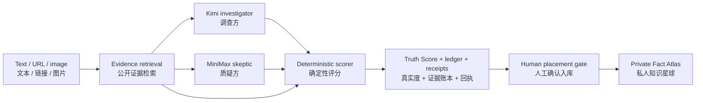

# Fact Atlas · 知识星球

**A verifiable personal knowledge map, powered by FactRelay and GonkaRouter.**
**一张会先核验、再落位，并为每条事实保留回执的个人知识地图。**

[Open Fact Atlas / 打开知识星球](https://fact-atlas.throughtheglass.art) · [Agent system / Agent 架构](docs/AGENT_SYSTEM.md) · [Trust boundaries / 信任边界](docs/ARCHITECTURE.md) · [PWA guide / 安装指南](docs/PWA.md)

Fact Atlas turns things people read, save, and remember into a spatial knowledge lineage whose evidence can still be inspected later. Before a claim enters the Atlas, FactRelay retrieves current public evidence, assigns opposing responsibilities to two Gonka models, calculates a deterministic Truth Score, and preserves upstream inference receipts. A human confirms the final placement; the product never invents coordinates.

Fact Atlas 把人们读到、收藏和记住的内容，变成日后仍能复核证据的空间知识谱系。一条主张进入知识星球之前，FactRelay 先检索公开证据，让两个 Gonka 模型分别担任调查方与质疑方，再用确定性代码计算 Truth Score。地点必须由用户确认，系统不伪造坐标。

## Product model / 产品结构

| Layer / 层 | Responsibility / 职责 |
| --- | --- |
| **FactRelay · 事实中继** | Retrieve evidence, run Gonka models, score, and preserve receipts. / 检索证据、运行 Gonka 模型、评分并保留回执。 |
| **Evidence Council · 证据法庭** | Evidence clerk → investigator → skeptic → deterministic judge → human gate. / 带边界的记录、调查、质疑、裁决与人工确认程序。 |
| **Fact Atlas · 知识星球** | Store a complete evidence snapshot and an optional user-confirmed place on a private Mapbox globe. / 将完整证据快照与可选的已确认地点保存在私人知识地球。 |
| **Signals · 每日发现** | One topic agent, one date, one source-linked card at a time. Gonka ranks importance, never truth. / 按主题与日期生成可滑动情报卡；Gonka 只排序重要性，不冒充真实度。 |



## Core guarantees / 核心保证

- **All semantic inference goes through GonkaRouter.** Retrieval, deterministic scoring, local storage, and map projection are deliberately non-AI layers.
  **所有语义推理只通过 GonkaRouter。** 检索、确定性评分、本地存储和地图投影都是可审计的非 AI 层。
- **Truth Score is code, not model prose.** Source stance, coverage, model verdicts, and disagreement are combined by tested rules.
  **Truth Score 由代码计算，不是模型随口给出的数字。**
- **Receipts prove provenance, not truth.** The original Gonka `response.id` is retained as `requestId`; it identifies an inference call but does not certify the claim.
  **回执证明调用来源，不等于证明事实为真。**
- **Private Atlas data remains in the browser.** No account or server-side history database is required.
  **私人星图完整快照保留在当前浏览器。**
- **No invented location or graph edge.** Unplaced facts remain visibly unplaced; relationships require an exact shared source or confirmed geographic proximity.
  **不伪造坐标，不用随机距离制造知识关联。**

## Gonka integration

All model calls use the OpenAI-compatible endpoint:

```text
https://api.gonkarouter.io/v1/chat/completions
```

| Responsibility / 角色 | Model ID |
| --- | --- |
| Visual claim extraction + investigator / 图像主张提取 + 调查方 | `moonshotai/Kimi-K2.6` |
| Adversarial cross-check / 对抗交叉审查 | `MiniMaxAI/MiniMax-M2.7` |

## Truth Score

```text
combined signal = 55% model consensus + 45% source-weighted evidence
Truth Score      = 50 + 50 × combined signal
```

Rules enforced before the score is emitted:

- Each source is counted once even if both models cite it.
- Hallucinated source indexes are rejected.
- Fewer than two assessed sources pulls the score toward 50.
- Model disagreement lowers decision confidence and remains visible.
- Two `insufficient` verdicts cannot produce a confident true/false label.

See [`server/scoring.mjs`](server/scoring.mjs) and [`server/scoring.test.mjs`](server/scoring.test.mjs).

## Install on iOS or Android / 安装到手机

The canonical HTTPS deployment is a standalone PWA with iOS, Android, and maskable icons.

- **iPhone/iPad:** open the site in Safari → Share → Add to Home Screen → Add.
  **iPhone/iPad：** Safari 打开网站 → “分享” → “添加到主屏幕” → “添加”。
- **Android:** open the browser menu → Install app or Add to Home screen.
  **Android：** 打开浏览器菜单 → “安装应用”或“添加到主屏幕”。

The service worker caches only the interface shell and versioned assets. Every `/api/*` request is network-only, so stale evidence cannot masquerade as a current run. Detailed behavior is documented in [`docs/PWA.md`](docs/PWA.md).

## Run locally

Requirements: Node.js 20 or newer.

```bash
npm install
cp .env.example .env.local
# add GONKA_API_KEY and MAPBOX_PUBLIC_TOKEN
npm run dev
```

Open <http://localhost:5173>. Without a Gonka key, the interface uses an explicitly labeled preview fixture and never fabricates request IDs.

Production-mode check:

```bash
npm run build
NODE_ENV=production HOST=127.0.0.1 PORT=5173 node server.mjs
```

## Environment variables

| Variable | Required | Default |
| --- | --- | --- |
| `GONKA_API_KEY` | Live verification and uncached Signals dates | — |
| `GONKA_BASE_URL` | No | `https://api.gonkarouter.io/v1` |
| `KIMI_MODEL` | No | `moonshotai/Kimi-K2.6` |
| `MINIMAX_MODEL` | No | `MiniMaxAI/MiniMax-M2.7` |
| `MAPBOX_PUBLIC_TOKEN` | Atlas basemap | — |
| `HOST` | No | `0.0.0.0` |
| `PORT` | No | `5173` |

## API

| Method | Route | Purpose |
| --- | --- | --- |
| `GET` | `/api/health` | Readiness and configured model IDs; never returns keys |
| `GET` | `/api/demo` | Explicitly labeled non-live preview fixture |
| `GET` | `/api/geocode?q=...` | Non-AI place candidates for user confirmation |
| `GET` | `/api/signals?topic=...&date=YYYY-MM-DD` | Dated news candidates; validated snapshots are served first, otherwise GonkaRouter ranks a live scan |
| `GET` | `/api/map-config` | Browser-safe Mapbox public configuration |
| `POST` | `/api/verify` | Complete verification pipeline |

## Quality checks

```bash
npm run verify
npm audit --audit-level=low
```

`npm run verify` performs strict TypeScript checking, **44 unit tests across 10 files**, and production builds for the self-hosted server and edge-worker target.

## Repository map

```text
src/                 React product UI and browser-local Atlas state
server/              retrieval, Gonka clients, dated signal snapshots, scoring, and tests
worker/              edge-hosting API entry
public/              PWA manifest, icons, service worker, social preview
deploy/online/       isolated PM2 + Nginx deployment assets
docs/                architecture, PWA, agents, operations, and Atlas model
```

## Documentation

- [`docs/ARCHITECTURE.md`](docs/ARCHITECTURE.md) — implementation, scoring, retrieval, and trust boundaries
- [`docs/AGENT_SYSTEM.md`](docs/AGENT_SYSTEM.md) — supervisors, subagents, Skills, and handoff contracts
- [`docs/FACT_ATLAS.md`](docs/FACT_ATLAS.md) — fact-node model, placement, and explainable relations
- [`docs/PWA.md`](docs/PWA.md) — iOS/Android installation, offline boundary, and update lifecycle
- [`docs/SIGNALS.md`](docs/SIGNALS.md) — dated snapshot lifecycle, validation rules, and cache semantics
- [`docs/DEPLOYMENT.md`](docs/DEPLOYMENT.md) — isolated self-hosting layout and TLS setup
- [`docs/OPERATIONS.md`](docs/OPERATIONS.md) — health checks, logs, rollback, and incident handling
- [`SECURITY.md`](SECURITY.md) — responsible disclosure and security model

## License

MIT
