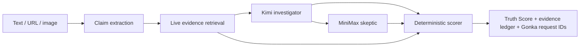

# FactRelay

**Traceable multi-model fact checking, powered by GonkaRouter.**

FactRelay checks public claims without asking users to trust one opaque model. It retrieves current public evidence, gives two Gonka models opposing responsibilities, computes a deterministic Truth Score, and exposes the upstream request ID for every AI inference.

> AI³ Growth Hackathon 2026 · Track 3: Gonka — AI for Society

[English details](#why-it-exists) · [架构边界](docs/ARCHITECTURE.md) · [提交与视频计划](docs/SUBMISSION.md)

## 中文说明

**FactRelay 是一个可追溯的多模型事实核查工作台。**

它不要求用户相信某一个模型生成的自信结论，而是将一条公开主张拆成一次可审查的调查：

1. 检索当前可访问的公开证据；
2. 通过 GonkaRouter 让 Kimi 担任调查方；
3. 让 MiniMax 以质疑方角色检查循环引用、时间错位、因果跳跃与遗漏背景；
4. 用确定性代码计算 0–100 Truth Score；
5. 展示来源账本、模型分歧、执行路径和真实 Gonka Request ID。

### 为什么需要 FactRelay

大多数 AI 事实核查只返回一段文字，却隐藏了三个核心问题：

- 哪些来源真正直接回应了待核查主张？
- 两个模型是独立达成共识，还是只在复述对方？
- 评审能否证明这些分析来自哪几次真实推理请求？

FactRelay 把这三个问题直接做成界面。

### 核心能力

- **文本、链接与图片输入：** Kimi-K2.6 可从文章或截图中提取可核查主张。
- **实时公开证据：** 非 AI 检索层读取提交页面与 Google News RSS。
- **双模型对抗审查：** Kimi 调查，MiniMax 质疑，分歧不会被隐藏。
- **确定性评分：** Truth Score 由模型结论、证据立场、来源覆盖与分歧程度共同计算，不由模型随口生成。
- **真实推理回执：** 界面原样展示 GonkaRouter 响应中的 `id`。
- **诚实预览模式：** 没有密钥时仍可查看完整界面，但不伪造 Request ID。

### Gonka 集成

所有 AI 推理均通过 GonkaRouter 的 OpenAI 兼容接口执行：

```text
https://api.gonkarouter.io/v1/chat/completions
```

| 职责 | Gonka 模型 |
| --- | --- |
| 图像主张提取 + 调查方 | `moonshotai/Kimi-K2.6` |
| 对抗交叉审查 | `MiniMaxAI/MiniMax-M2.7` |

### 本地运行

需要 Node.js 20 或更高版本。

```bash
npm install
cp .env.example .env.local
# 在 .env.local 中添加 GONKA_API_KEY
npm run dev
```

打开 [http://localhost:5173](http://localhost:5173)。详细评分公式、安全边界和 API 说明见下方英文文档。

---

## Why it exists

Most AI fact checkers return a confident paragraph. That hides three important questions:

1. Which sources actually address the claim?
2. Did independent models agree, or did one merely echo the other?
3. Can a reviewer prove which inference requests produced the result?

FactRelay turns those questions into the interface.

## What the demo shows

- **Text, URL, and image input.** Kimi-K2.6 can extract a claim from an article or screenshot.
- **Current public evidence.** A non-AI retrieval layer gathers Google News RSS results and the submitted page.
- **Adversarial model roles.** Kimi investigates; MiniMax challenges source laundering, missing context, and causal leaps.
- **Deterministic Truth Score.** The final score is calculated by code from model verdicts, source stance, coverage, and disagreement.
- **Real Gonka receipts.** The UI displays the unmodified `id` returned by GonkaRouter for each model call.
- **Honest preview mode.** The bundled preview is clearly labeled and never fabricates request IDs.

## Gonka integration

All AI inference goes through the OpenAI-compatible GonkaRouter endpoint:

```text
https://api.gonkarouter.io/v1/chat/completions
```

Default models:

| Responsibility | Gonka model ID |
| --- | --- |
| Visual claim extraction + investigator | `moonshotai/Kimi-K2.6` |
| Adversarial cross-check | `MiniMaxAI/MiniMax-M2.7` |

The backend preserves `response.id` as `requestId`. Local run IDs such as `fr_…` are kept separate and are never presented as Gonka provenance.

## Verification pipeline



Retrieval does not use another AI provider. It fetches public HTML and RSS. Every inference step uses GonkaRouter.

## Truth Score

The score is not a number requested from a model.

```text
combined signal = 55% model consensus + 45% source-weighted evidence
Truth Score      = 50 + 50 × combined signal
```

Additional rules:

- Each source is counted once even when both models cite it.
- Hallucinated source indexes are rejected before scoring.
- Fewer than two assessed sources pulls the score toward 50.
- Model disagreement lowers decision confidence and remains visible.
- Two `insufficient` verdicts can never produce a confident true/false label.

The implementation and tests live in [`server/scoring.mjs`](server/scoring.mjs) and [`server/scoring.test.mjs`](server/scoring.test.mjs).

## Run locally

Requirements: Node.js 20 or newer.

```bash
npm install
cp .env.example .env.local
# add GONKA_API_KEY to .env.local
npm run dev
```

Open [http://localhost:5173](http://localhost:5173).

Without a key, the full interface remains available through an explicitly labeled preview fixture. Live verification returns a clear `GONKA_API_KEY_MISSING` error instead of simulated AI output.

## Environment variables

| Variable | Required | Default |
| --- | --- | --- |
| `GONKA_API_KEY` | For live runs | — |
| `GONKA_BASE_URL` | No | `https://api.gonkarouter.io/v1` |
| `KIMI_MODEL` | No | `moonshotai/Kimi-K2.6` |
| `MINIMAX_MODEL` | No | `MiniMaxAI/MiniMax-M2.7` |
| `PORT` | No | `5173` |

## Quality checks

```bash
npm run verify
npm audit --audit-level=low
```

`npm run verify` runs strict TypeScript checking, unit tests, and the production build.

## API

| Method | Route | Purpose |
| --- | --- | --- |
| `GET` | `/api/health` | Readiness and configured model IDs; never returns the key |
| `GET` | `/api/demo` | Clearly labeled non-live preview fixture |
| `POST` | `/api/verify` | Run the complete verification pipeline |

Example request:

```json
{
  "kind": "text",
  "content": "The Eiffel Tower becomes taller during hot weather because metal expands."
}
```

## Safety and integrity

- Submitted URLs are restricted to public HTTP(S) hosts; private and local network addresses are blocked.
- Redirect destinations are revalidated to reduce SSRF risk.
- Remote page content and model drafts are explicitly treated as untrusted prompt data.
- Images are restricted to PNG, JPEG, or WebP and capped at 5 MB.
- API keys stay server-side and are excluded from Git.
- The project does not claim that an inference receipt proves a statement true; it proves which Gonka request produced the analysis.

## Documentation

- [`docs/ARCHITECTURE.md`](docs/ARCHITECTURE.md) — implementation and trust boundaries
- [`docs/SUBMISSION.md`](docs/SUBMISSION.md) — submission copy and video plan

## License

MIT
