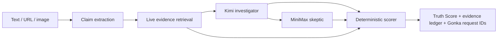

# Fact Atlas · 知识星球

**A verifiable personal knowledge map, powered by FactRelay and GonkaRouter.**
**一张会先核验、再落位的个人知识地图。**

Fact Atlas turns the things people read, save, and remember into a spatial knowledge lineage whose evidence can still be inspected later. Before a claim can enter the Atlas, the FactRelay engine retrieves public evidence, assigns opposing responsibilities to two Gonka models, computes a deterministic Truth Score, and preserves every upstream inference receipt. A human confirms the final placement; the product never invents coordinates.

Fact Atlas 把人们读到、收藏和记住的内容，变成一条日后仍能复核证据的空间知识谱系。一条主张进入知识星球之前，FactRelay 会先检索公开证据，让两个 Gonka 模型分别承担调查与质疑职责，用确定性代码计算 Truth Score，并保留上游推理回执。最终地点由用户确认，系统不伪造坐标。

> AI³ Growth Hackathon 2026 · Track 3: Gonka — AI for Society

[Public demo / 在线演示](https://factrelay-ai3-2026.yediqizhang37.chatgpt.site) · [2:30 bilingual demo / 双语演示视频](https://github.com/narratorzhang0307/FactRelay/releases/tag/ai3-2026-submission) · [Agent system / Agent 架构](docs/AGENT_SYSTEM.md) · [架构边界](docs/ARCHITECTURE.md) · [提交材料](docs/SUBMISSION.md)

## Product model / 产品结构

| Layer / 层 | Responsibility / 职责 |
| --- | --- |
| **FactRelay · 事实中继** | Retrieve evidence, run Gonka models, score, and preserve receipts. / 检索证据、运行 Gonka 模型、评分并保留回执。 |
| **Evidence Council · 证据法庭** | Evidence clerk → Kimi investigator → MiniMax skeptic → human gate. / 记录与调查、质疑、人工确认的有边界程序。 |
| **Fact Atlas · 知识星球** | Store the complete evidence snapshot and a user-confirmed place on a private Mapbox globe. / 把完整证据快照与用户确认的地点保存进私人 Mapbox 知识地球。 |
| **Signals · 每日发现** | Select a theme and date; one topic agent presents a swipeable, source-linked card deck and uses Gonka to rank importance—never truth. / 选择主题与日期，由对应 Agent 输出可滑动、可追源的新闻卡片；Gonka 只排序重要性，不冒充真实度。 |

The three responsive views use one visual language on desktop and mobile. The project deliberately removes Pocket Earth's photos, music, books, lifestyle collections, and oversized agent gallery; only the useful world/knowledge-map interaction model remains.

## Live proof / 实时运行证明

The production deployment is connected to GonkaRouter. A final public smoke run on **2026-07-15** returned a live `refuted` verdict for the Great Wall/Moon claim with a deterministic Truth Score of **18**, **88%** decision confidence, **5** retrievable sources, and non-null upstream request IDs from both models.

公开部署已连接 GonkaRouter。**2026-07-15** 的最终公开烟雾测试对“从月球肉眼看到长城”给出实时 `事实不符` 结论：确定性 Truth Score 为 **18**、结论信心 **88%**、可追溯来源 **5** 个，两个模型均返回非空上游 Request ID。

| Deliverable / 交付项 | Public link / 公开链接 |
| --- | --- |
| Running product / 在线产品 | <https://factrelay-ai3-2026.yediqizhang37.chatgpt.site> |
| Public repository / 公开仓库 | <https://github.com/narratorzhang0307/FactRelay> |
| Demo video release / 演示视频 | <https://github.com/narratorzhang0307/FactRelay/releases/tag/ai3-2026-submission> |
| Direct 2:30 MP4 / 2分30秒视频直链 | <https://github.com/narratorzhang0307/FactRelay/releases/download/ai3-2026-submission/FactAtlas_Demo_2m30s_Bilingual.mp4> |

## 中文说明

**Fact Atlas 是一个由 FactRelay 驱动的可验证个人知识地图。**

它不要求用户相信某一个模型生成的自信结论，而是将一条公开主张拆成一次可审查的调查：

1. 检索当前可访问的公开证据；
2. 通过 GonkaRouter 让 Kimi 担任调查方；
3. 让 MiniMax 以质疑方角色检查循环引用、时间错位、因果跳跃与遗漏背景；
4. 用确定性代码计算 0–100 Truth Score；
5. 展示来源账本、模型分歧、执行路径和真实 Gonka Request ID。

### 为什么需要 FactRelay

大多数 AI 事实核查只返回一段文字，却隐藏了三个核心问题：

- 哪些来源真正直接回应了待核查主张？
- 两个模型是独立达成共识，还是只在复述对方？
- 评审能否证明这些分析来自哪几次真实推理请求？

FactRelay 把这三个问题直接做成界面；Fact Atlas 则把核验后的知识变成可持续积累的个人知识谱系。

### 核心能力

- **文本、链接与图片输入：** Kimi-K2.6 可从文章或截图中提取可核查主张。
- **实时公开证据：** 非 AI 检索层读取提交页面与 Google/Bing News RSS；内置演示主张另使用透明列出的 NASA、ESA 和 Smithsonian 权威种子链接，并在运行时实时抓取。
- **双模型对抗审查：** Kimi 调查，MiniMax 质疑，分歧不会被隐藏。
- **确定性评分：** Truth Score 由模型结论、证据立场、来源覆盖与分歧程度共同计算，不由模型随口生成。
- **真实推理回执：** 界面原样展示 GonkaRouter 响应中的 `id`。
- **诚实预览模式：** 没有密钥时仍可查看完整界面，但不伪造 Request ID。
- **可验证知识星球：** 保存完整核验快照；地点必须由用户确认，否则保留在“未落位轨道”。
- **真实 Mapbox 地球：** 深色底图承载亮色事实节点；桌面端可用箭头旋转，手机端可直接拖动缩放。
- **全球主题 Signals：** AI、科技、金融、气候能源、科学、健康生物、城市文化与公共政策 Agent 每日给出可核查候选。
- **按日期与主题浏览：** 每个主题独立成卡，单次只看一条；桌面箭头、手机滑动，避免热门主题淹没其他领域。
- **主 Agent + 子 Agent + Skills：** Signals 与 Relay 均返回可审查的编排契约、能力清单和人工闸门。
- **可安装 PWA：** iOS 与 Android 浏览器可添加到主屏幕；应用外壳可离线打开，但核验、新闻和回执 API 永远只走实时网络。
- **可解释关系：** 只因共享的精确来源或 300 公里内的已确认地理关系连线，不用随机距离伪造“知识关联”。

### Gonka 集成

所有 AI 推理均通过 GonkaRouter 的 OpenAI 兼容接口执行：

```text
https://api.gonkarouter.io/v1/chat/completions
```

| 职责 | Gonka 模型 |
| --- | --- |
| 图像主张提取 + 调查方 | `moonshotai/Kimi-K2.6` |
| 对抗交叉审查 | `MiniMaxAI/MiniMax-M2.7` |

### 本地运行

需要 Node.js 20 或更高版本。

```bash
npm install
cp .env.example .env.local
# 在 .env.local 中添加 GONKA_API_KEY 与 MAPBOX_PUBLIC_TOKEN
npm run dev
```

打开 [http://localhost:5173](http://localhost:5173)。详细评分公式、安全边界和 API 说明见下方英文文档。

---

## Why it exists

Most AI fact checkers return a confident paragraph. That hides three important questions:

1. Which sources actually address the claim?
2. Did independent models agree, or did one merely echo the other?
3. Can a reviewer prove which inference requests produced the result?

FactRelay turns those questions into the interface.

## What the demo shows

- **Text, URL, and image input.** Kimi-K2.6 can extract a claim from an article or screenshot.
- **Current public evidence.** A non-AI retrieval layer gathers the submitted page plus Google News RSS with a concurrent Bing News RSS fallback. The built-in Great Wall starter additionally fetches a transparent allowlist of live NASA, ESA, and Smithsonian pages.
- **Adversarial model roles.** Kimi investigates; MiniMax challenges source laundering, missing context, and causal leaps.
- **Deterministic Truth Score.** The final score is calculated by code from model verdicts, source stance, coverage, and disagreement.
- **Real Gonka receipts.** The UI displays the unmodified `id` returned by GonkaRouter for each model call.
- **Honest preview mode.** The bundled preview is clearly labeled and never fabricates request IDs.

## Gonka integration

All AI inference goes through the OpenAI-compatible GonkaRouter endpoint:

```text
https://api.gonkarouter.io/v1/chat/completions
```

Default models:

| Responsibility | Gonka model ID |
| --- | --- |
| Visual claim extraction + investigator | `moonshotai/Kimi-K2.6` |
| Adversarial cross-check | `MiniMaxAI/MiniMax-M2.7` |

The backend preserves `response.id` as `requestId`. Local run IDs such as `fr_…` are kept separate and are never presented as Gonka provenance.

## Verification pipeline



Retrieval does not use another AI provider. It fetches public HTML and RSS. Every inference step uses GonkaRouter.

## Truth Score

The score is not a number requested from a model.

```text
combined signal = 55% model consensus + 45% source-weighted evidence
Truth Score      = 50 + 50 × combined signal
```

Additional rules:

- Each source is counted once even when both models cite it.
- Hallucinated source indexes are rejected before scoring.
- Fewer than two assessed sources pulls the score toward 50.
- Model disagreement lowers decision confidence and remains visible.
- Two `insufficient` verdicts can never produce a confident true/false label.

The implementation and tests live in [`server/scoring.mjs`](server/scoring.mjs) and [`server/scoring.test.mjs`](server/scoring.test.mjs).

## Run locally

Requirements: Node.js 20 or newer.

```bash
npm install
cp .env.example .env.local
# add GONKA_API_KEY and MAPBOX_PUBLIC_TOKEN to .env.local
npm run dev
```

Open [http://localhost:5173](http://localhost:5173).

Without a key, the full interface remains available through an explicitly labeled preview fixture. Live verification returns a clear `GONKA_API_KEY_MISSING` error instead of simulated AI output.

## Install on a phone / 安装到手机

- iPhone/iPad: open the public demo in Safari, tap **Share**, then **Add to Home Screen**. / 用 Safari 打开在线版，点“分享”→“添加到主屏幕”。
- Android: open the browser menu and choose **Install app** or **Add to Home screen**. / 打开浏览器菜单，选择“安装应用”或“添加到主屏幕”。
- The installed app runs in a standalone window. Its service worker caches only the interface shell; `/api/*` is explicitly network-only so stale evidence can never masquerade as a fresh run.

## Environment variables

| Variable | Required | Default |
| --- | --- | --- |
| `GONKA_API_KEY` | For live runs | — |
| `GONKA_BASE_URL` | No | `https://api.gonkarouter.io/v1` |
| `KIMI_MODEL` | No | `moonshotai/Kimi-K2.6` |
| `MINIMAX_MODEL` | No | `MiniMaxAI/MiniMax-M2.7` |
| `MAPBOX_PUBLIC_TOKEN` | For the Atlas basemap | — |
| `PORT` | No | `5173` |

## Quality checks

```bash
npm run verify
npm audit --audit-level=low
```

`npm run verify` runs strict TypeScript checking, **41 unit tests across 10 files**, and the production build. `npm audit --audit-level=low` currently reports zero known vulnerabilities.

## API

| Method | Route | Purpose |
| --- | --- | --- |
| `GET` | `/api/health` | Readiness and configured model IDs; never returns the key |
| `GET` | `/api/demo` | Clearly labeled non-live preview fixture |
| `GET` | `/api/geocode?q=...` | Non-AI place candidates for explicit user confirmation |
| `GET` | `/api/signals?topic=...&date=YYYY-MM-DD` | Dated public-news candidates ranked by Kimi through GonkaRouter |
| `GET` | `/api/map-config` | Public Mapbox browser configuration; never returns a secret token |
| `POST` | `/api/verify` | Run the complete verification pipeline |

Example request:

```json
{
  "kind": "text",
  "content": "The Eiffel Tower becomes taller during hot weather because metal expands."
}
```

## Safety and integrity

- Submitted URLs are restricted to public HTTP(S) hosts; private and local network addresses are blocked.
- Redirect destinations are revalidated to reduce SSRF risk.
- Remote page content and model drafts are explicitly treated as untrusted prompt data.
- Images are restricted to PNG, JPEG, or WebP and capped at 5 MB.
- API keys stay server-side and are excluded from Git.
- The project does not claim that an inference receipt proves a statement true; it proves which Gonka request produced the analysis.

## Documentation

- [`docs/ARCHITECTURE.md`](docs/ARCHITECTURE.md) — implementation and trust boundaries
- [`docs/AGENT_SYSTEM.md`](docs/AGENT_SYSTEM.md) — main agents, subagents, Skills, and handoff contracts
- [`docs/FACT_ATLAS.md`](docs/FACT_ATLAS.md) — Atlas data, placement, and Pocket Earth reuse boundary
- [`docs/SUBMISSION.md`](docs/SUBMISSION.md) — submission copy and video plan

## License

MIT
