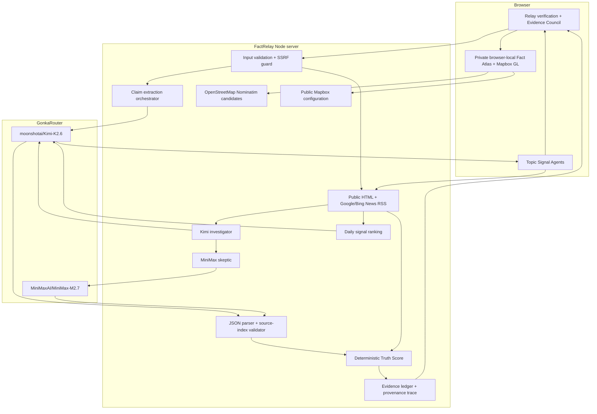

# Fact Atlas / FactRelay architecture and trust boundaries

## Product invariant

FactRelay may be uncertain, but it must not be untraceable.

That produces four non-negotiable rules:

1. Every AI inference goes through GonkaRouter.
2. A source must exist in the retrieved corpus before a model may cite its index.
3. The final Truth Score is calculated by code, not generated as prose.
4. A Gonka Request ID must be the untouched upstream response `id`; local IDs use a different prefix.

## System map



## Request sequence

The executable Agent/Skill decomposition and handoff contracts are documented in [`AGENT_SYSTEM.md`](AGENT_SYSTEM.md). Both `/api/demo` and every new live verification result return the Relay agent contract; `/api/signals` returns its supervisor, selected topic agent, and shared Skill list.

### Daily topic signal

```text
Signal Supervisor
  → selected date + one of eight topic agents
  → validated immutable snapshot lookup
  → snapshot hit: return cards + original Gonka receipt immediately
  → snapshot miss: continue with the live path below
  → multi-region Google/Bing public-news retrieval
  → deterministic date-window filter + normalization + deduplication
  → Kimi importance ranking through GonkaRouter
  → bilingual checkable-claim candidates + upstream request receipt
  → user selection
  → full FactRelay verification sequence below
```

The first-stage `importance` score is explicitly not a Truth Score. It prioritizes which items may deserve attention; it does not assert that the headline is true.

Snapshots do not bypass inference. They preserve the output of an earlier completed Gonka ranking, including its request ID, trace, generation time, and source URLs. A checked-in snapshot is immutable for its date. Runtime in-memory caching is a separate, shorter-lived layer. See [`SIGNALS.md`](SIGNALS.md) for the generation and validation contract.

### Text claim

```text
claim
  → current-news retrieval
  → Kimi investigator
  → MiniMax adversarial cross-check
  → normalization and deterministic score
```

Two Gonka requests are expected.

### Public URL

```text
URL validation
  → page fetch
  → Kimi central-claim extraction
  → current-news retrieval
  → Kimi investigator
  → MiniMax adversarial cross-check
  → deterministic score
```

Three Gonka requests are expected.

### Screenshot or image

```text
image validation
  → Kimi vision claim extraction
  → current-news retrieval
  → Kimi investigator
  → MiniMax adversarial cross-check
  → deterministic score
```

Three Gonka requests are expected. MiniMax receives extracted text and the evidence corpus; it does not pretend to have processed the image.

## Adversarial roles

The two models are deliberately not asked the same generic question.

### Kimi investigator

- Extracts the exact checkable proposition.
- Checks chronology, source independence, directness, and relevance.
- Assigns source stance and reliability.
- Uses vision for screenshots.

### MiniMax skeptic

- Receives the evidence packet and Kimi draft as untrusted input.
- Looks for source laundering, circular reporting, date mismatch, causal leaps, and omitted context.
- Produces an independent verdict and may disagree.

This is closer to fault-tolerant consensus than majority voting: dissent is an output, not an error to hide.

## Deterministic scoring

Each verdict becomes a signed signal:

| Model verdict | Signal |
| --- | ---: |
| `supported` | +1 × model confidence |
| `refuted` | −1 × model confidence |
| `mixed` | 0 |
| `insufficient` | 0 |

Each valid evidence assessment becomes a signed reliability signal:

| Source stance | Signal |
| --- | ---: |
| `support` | +1 × source reliability |
| `refute` | −1 × source reliability |
| `context` | 0 |

Assessments from both models are first combined per source so a repeated citation cannot double-count one article.

```text
model consensus  = average model signal
evidence balance = average per-source signal
combined signal  = 0.55 × model consensus + 0.45 × evidence balance
Truth Score      = clamp(50 + 50 × combined signal, 0, 100)
```

Guardrails:

- A nonexistent `sourceIndex` is removed during normalization.
- Fewer than two assessed sources pulls the score 65% back toward 50.
- An all-`insufficient` result is labeled `insufficient`, regardless of the numeric direction.
- Confidence combines model confidence, agreement, and source coverage, and is capped at 48% for weak evidence.

## Provenance model

The public response contains two different ID classes:

| Field | Origin | Meaning |
| --- | --- | --- |
| `id: fr_…` | FactRelay | Local report/run identifier |
| `requestId: msg_…` or provider value | GonkaRouter | Exact upstream inference response ID |

Preview fixtures set `requestId` to `null`. They never use realistic fake identifiers.

Each trace step records:

```json
{
  "stage": "skeptic-cross-check",
  "provider": "GonkaRouter",
  "model": "MiniMaxAI/MiniMax-M2.7",
  "requestId": "<upstream response id>",
  "startedAt": "<ISO timestamp>",
  "durationMs": 8421,
  "status": "complete"
}
```

## Retrieval is not inference

FactRelay's evidence layer uses deterministic network retrieval:

- The submitted public page is fetched directly.
- Related coverage is requested concurrently from Google News RSS and Bing News RSS; the first successful usable result wins.
- Signals fan out across Google US/GB/CN and Bing US feeds, merge the results deterministically, and expose the exact seven-day coverage window for the selected edition date.
- The built-in Great Wall/Moon starter transparently adds a small allowlist of live NASA, ESA, and Smithsonian pages. Those pages are fetched at runtime and remain ordinary inspectable evidence, not bundled model answers.
- The result packet contains title, publisher, timestamp, URL, and excerpt.

This layer does not call Gemini, OpenAI, local models, or any other inference provider. All semantic analysis is routed through Gonka.

## Trust boundaries

### Browser → FactRelay server

- Input kind is an allowlist: text, URL, or image.
- Text is bounded to 8,000 characters.
- Images are restricted to PNG/JPEG/WebP and approximately 5 MB.
- The API key never enters browser code or the health response.
- `/api/map-config` exposes only a browser-safe Mapbox `pk.` public token; it never accepts or returns a secret Mapbox token.

### Atlas placement and mapping

- Nominatim returns deterministic place candidates; it does not decide which location is correct.
- The user must click one candidate before coordinates are stored.
- A claim may be saved without coordinates and remains visibly unplaced.
- The browser stores the complete result snapshot locally; the server does not upload a private Atlas history.
- Mapbox renders the dark basemap, bright verdict markers, and deterministic explainable links. It is a visualization layer, not an inference provider.

### PWA shell

- The web manifest exposes standalone iOS/Android installation assets and a claim-verification shortcut.
- The service worker caches only the application shell and static same-origin assets.
- `/api/*` requests are explicitly network-only, so a prior verification, news edition, receipt, health state, or map configuration cannot be replayed as current data.
- Offline mode means “the interface can open,” never “the evidence is fresh.”

### FactRelay server → submitted URL

- Only HTTP and HTTPS are accepted.
- Embedded credentials are rejected.
- Localhost, `.local`, loopback, link-local, and private IP ranges are rejected.
- DNS results and every redirect destination are revalidated.
- Redirects are limited and fetched pages are size-bounded.

### Retrieved content → model prompt

- Page text, source excerpts, and previous model drafts are labeled untrusted.
- System prompts explicitly reject instructions found inside those inputs.
- Models may cite only numbered sources included in the packet.
- Source indexes are validated again after inference.

## Failure behavior

| Failure | User-visible behavior |
| --- | --- |
| No Gonka key | `GONKA_API_KEY_MISSING`; preview remains available |
| Retrieval unavailable | Continue with partial evidence; score is pulled toward uncertainty |
| Invalid model JSON | Stop with a structured verification failure, never invent a verdict |
| One malformed model response | Retry the same Gonka model once with a strict JSON-only instruction; preserve the failed call as a `partial` trace step |
| Provider rate limit | Return `GONKA_RATE_LIMITED` |
| 180-second timeout | Return `VERIFICATION_TIMEOUT` |
| Too few sources | Label `insufficient` and cap confidence |

## Deliberate non-features

- No user accounts or server-side history database.
- No blockchain write, token, or wallet. Gonka is the decentralized inference substrate; unrelated on-chain theater would not strengthen factual accuracy.
- No hidden fallback to another AI provider.
- No model-generated numeric score used as the final Truth Score.
- No automatic publishing into the Atlas. Topic agents can suggest; only a user-confirmed, deeply verified claim may be stored.
- No invented coordinates, random graph edges, or decorative map points.

## Local research influence

The locally supplied blockchain reading informed three design decisions without being redistributed:

- Consensus requires an explicit threshold; it is not vague agreement.
- Fault tolerance means preserving dissent and degrading safely when nodes/evidence fail.
- Auditability depends on a replayable sequence of records, not on a decorative “blockchain” label.

Those principles appear in the deterministic scorer, disagreement UI, and provenance trace.
