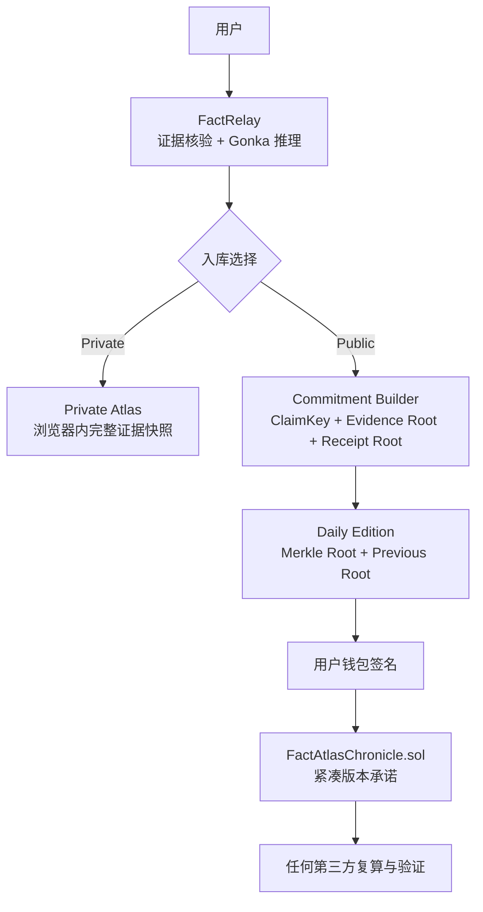

# Fact Atlas Chronicle · 混合式知识 DApp

Fact Atlas Chronicle 是公开知识的完整性与修订层。它把用户明确公开的核验结果组织成按日追加的知识版本链，同时让私人 Atlas、全文证据和模型推理留在设备与链下服务中。

## 设计目标

1. 证明某个发布者在某个时间提交了哪一版公共知识；
2. 检测事实记录、证据、回执、分数或评分规则是否被修改；
3. 保留每日版次与同日修订的前后关系；
4. 为单条事实提供 Merkle inclusion proof；
5. 默认不公开私人知识、全文证据、浏览历史和精确地点；
6. 不把区块链时间戳或模型回执误称为事实真伪证明。

## 混合架构



### 链下保留

- 原始网页、截图、摘要和全文证据；
- Kimi / MiniMax 的完整输入与输出；
- 私人 Atlas 节点和未公开地点；
- Mapbox 渲染与图谱关系；
- Signals 抓取、去重、排序和三日缓存。

### 链上保存

- 发布者地址；
- `day` 与同日 `revision`；
- `editionRoot`；
- `previousEditionRoot`；
- `manifestHash`；
- `policyRoot`；
- `factCount` 与区块时间。

## 三层事实身份与完整性

### 1. ClaimKey：稳定的规范事实身份

`ClaimKey = SHA-256(stableJSON(ClaimIdentity))`

`ClaimIdentity` 包含：

- 用户确认的 canonical statement；
- 用户确认的 location scope（可为空）；
- time scope（可为空）。

实现只消除 NFKC、大小写、标点、分隔符和多余空格差异。下列文本可以得到相同规范形式：

```text
Great Wall visible from Moon?
great wall visible from moon
```

同义改写不会被自动合并。自然语言语义等价由用户确认 canonical claim，系统保留原始表述的精确快照。

### 2. Record Hash：可检测任何记录变化

单条公共事实包含：

```text
claimKey
rawSnapshotHash
evidenceRoot
receiptRoot
scorePolicyHash
verdict
truthScore
confidence
createdAt
```

这些字段共同生成 `recordHash`。证据来源、Gonka Request ID、执行顺序、分数或时间发生变化，都会生成新的记录指纹。

### 3. Edition Root：按日追加的知识链

同一天全部 `recordHash` 排序后生成 `factsRoot`。再把 `factsRoot`、`manifestHash`、`policyRoot`、`previousEditionRoot`、日期和事实数量共同生成 `editionRoot`。

```text
Edition 2026-07-16
  ├─ factsRoot
  │   ├─ recordHash A
  │   ├─ recordHash B
  │   └─ recordHash C
  ├─ manifestHash
  ├─ policyRoot
  └─ previousEditionRoot ──> Edition 2026-07-15
```

## 智能合约

合约位于 [`contracts/FactAtlasChronicle.sol`](../contracts/FactAtlasChronicle.sol)。它没有管理员、Token、质押或自动事实裁决。

每个发布者地址拥有独立链头：

```solidity
struct ChainHead {
    bytes32 editionRoot;
    uint32 day;
    uint32 revision;
    uint64 committedAt;
}
```

`commitEdition` 强制：

- 版本不能为空；
- 日期格式在允许区间；
- 新提交的 `previousEditionRoot` 必须等于当前链头；
- 日期只能前进或对当前日期追加修订；
- 同日修订号自动加一。

## 验证流程

第三方验证一条公共事实时：

1. 下载公开 proof bundle；
2. 对 canonical claim、完整快照、来源和回执复算承诺；
3. 使用 Merkle proof 验证 `recordHash` 属于 `factsRoot`；
4. 复算 `editionRoot`；
5. 查询合约事件与发布者链头；
6. 检查版本是否链接到正确的前序根；
7. 独立审阅来源质量，再判断结论是否可信。

前六步验证完整性、发布者和顺序。第七步才讨论事实本身。

## 隐私模式

| 模式 | 完整内容 | 链上状态 | 钱包 |
| --- | --- | --- | --- |
| Private Atlas | 当前浏览器 | 无 | 不需要 |
| Public Chronicle | 公开 proof bundle / 链下存储 | 每日紧凑承诺 | 发布时签名 |

未来可以增加“加密分享”模式：链上只保存带随机盐的承诺，指定接收者通过密钥封装获得解密权限。当前版本不会把私人知识自动升级为公共记录。

## 钱包与 Gas

钱包承担发布者身份和签名。项目不发行 Token。标准 EVM 钱包可直接调用合约；面向普通用户的部署建议使用账户抽象与 sponsor paymaster，让界面呈现为“签名并发布”，由应用代付 Gas。

## 威胁边界

| 风险 | 当前约束 |
| --- | --- |
| 发布者提交错误事实 | 合约只证明发布历史；UI 始终展示公开证据与争议状态 |
| 证据网页后来变化或消失 | `rawSnapshotHash` 与 `evidenceRoot` 可检测快照变化；可用性依赖链下持久化 |
| 两句话被错误合并 | 同义等价必须由用户确认 canonical claim |
| 模型伪造来源编号 | 评分前拒绝不存在的 `sourceIndex` |
| Gonka Request ID 被误当证明 | Request ID 只作为上游调用回执字段；事实仍由证据判断 |
| 私人内容被误公开 | Private/Public 是显式入库选择；公开承诺只接受 live 核验 |
| 历史被静默覆盖 | 合约强制前序根与追加式 revision |

## 本地验证

```bash
npm test -- --run src/knowledge-chain.test.ts src/atlas.test.ts
npm run contract:compile
npm run build
```

部署合约后配置公开前端变量：

```bash
VITE_FACT_ATLAS_CONTRACT_ADDRESS=0x...
VITE_FACT_ATLAS_CHAIN_NAME=Base Sepolia
VITE_FACT_ATLAS_CHAIN_ID=84532
VITE_FACT_ATLAS_RPC_URL=https://sepolia.base.org
VITE_FACT_ATLAS_EXPLORER_URL=https://sepolia-explorer.base.org
```

Base Sepolia 部署命令：

```bash
read -s FACT_ATLAS_DEPLOYER_PRIVATE_KEY
export FACT_ATLAS_DEPLOYER_PRIVATE_KEY
npm run contract:deploy:base-sepolia
unset FACT_ATLAS_DEPLOYER_PRIVATE_KEY
```

部署脚本会在发送交易前核对 chain ID 必须为 `84532`，并拒绝余额为零的钱包。私钥只从当前进程环境读取，绝不能写入 `.env.local`、源码、日志或 Git。

缺少合约地址时，产品仍能生成、展示和导出本地 Merkle proof bundle，但不会伪装成已经上链。
